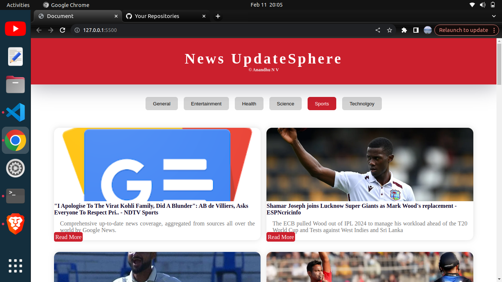

# News Aggregator

This project is a simple news aggregator application that fetches news articles from the NewsAPI based on different categories.

## Features

- **Category Selection**: Users can select from various categories such as general, entertainment, health, science, sports, and technology to view news articles.
- **Dynamic UI**: The application dynamically generates news cards with images, titles, descriptions, and links to read more about each article.
- **Responsive Design**: The UI is designed to be responsive and adapt to different screen sizes.

## Screenshots



*Home page showing news articles from various categories.*

## Installation

To install and run the project locally, follow these steps:

1. Clone the repository to your local machine:

   ```bash
   git clone https://github.com/yourusername/news-aggregator.git


